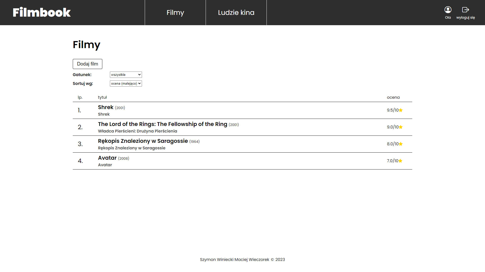
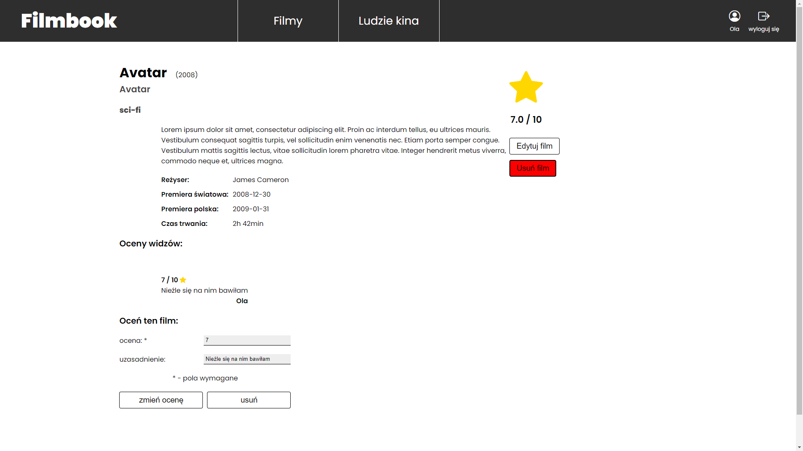
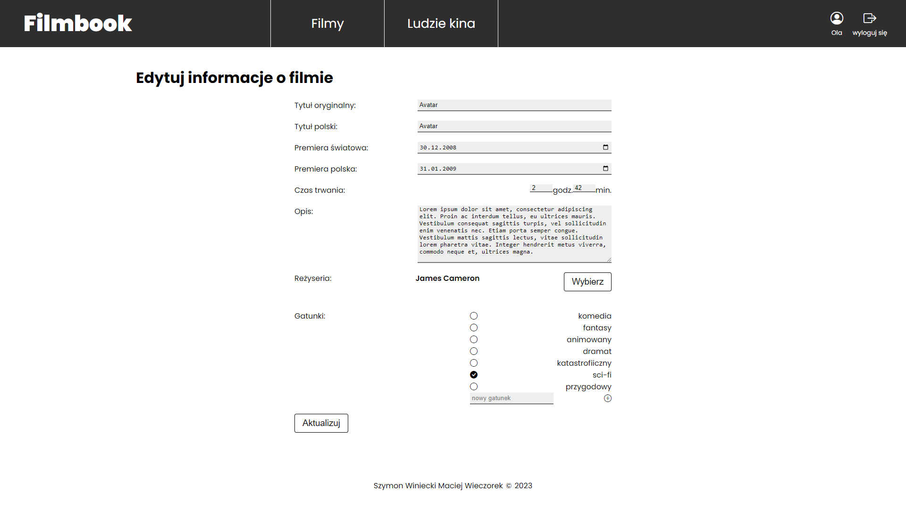

# FilmBook

A project implemented for the **SQL and NoSQL Database Management** course at **Poznan University of Technology**.

## Overview

**FilmBook** is a service designed for managing movies and related information. It allows to:

- Explore a movie database.
- Rate and review productions.
- Expand the movie database by adding new entries or editing existing ones.
- Leverage an extended admin panel to manage users, ranks, and permissions.

## Tech Stack

- **Backend**: Node.js, Express
- **Frontend**: React
- **Database**: PostgreSQL
- **Authentication**: JWT (JSON Web Tokens)

## Features

### User Features
- **Explore Content**: Browse movies, actors, and directors, and view detailed information about them.
- **User Management**: Register, log in, and manage your account.
- **Database Expansion**: Add, edit, or remove movies and associated individuals (e.g., actors, directors).
- **Movie Interaction**: Rate movies and write reviews.

### Admin Features
- **Admin Panel**: Manage user accounts, assign ranks, and control permissions for various actions within the system.

## How to run the app

Follow these steps to set up and run the application on your local machine.

### 1. Set Up the Database

1. **Install PostgreSQL**: If not already installed, download and install it from [PostgreSQL Downloads](https://www.postgresql.org/download/).
2. **Configure Database Credentials**:
   - Modify the database user password in `database/create_scheme.ddl` (line #3).
3. **Initialize the Database**:
   - Run the following scripts:
     - `database/conf/initDB.bat`
     - `database/conf/create_scheme.bat`
4. **Start and Stop Database**:
   - To start the server, run `database/conf/startDB.bat`.
   - To stop the server, run `database/conf/stopDB.bat`.

### 2. Start the Server

1. **Configure Server**:
   - Review and adjust the configuration files:
     - `server/.env.scheme`
     - `server/dbconn/credentials_scheme.json`
2. **Run the Server**:
   - Navigate to the `server/` directory and run:
        ```node index.js```

### 3. Run the Client App

1. **Adjust Client Configuration**:
   - Update the server address and port in `client/src/constant_properties.js`.
2. **Start the Client**:
   - Navigate to the `client/` directory and run:
     ```npm start```

## Screenshots

For more screenshots, check the `screenshots/` directory.






